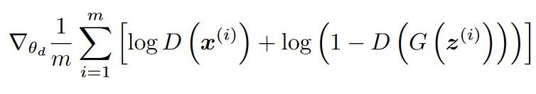
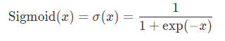
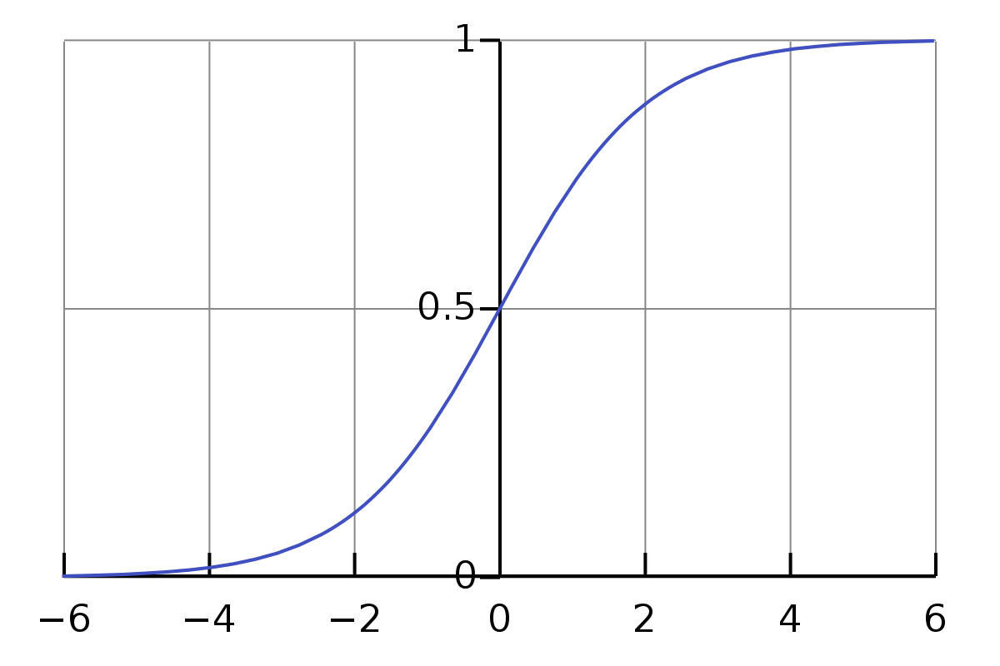
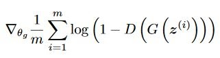
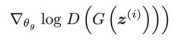

# MNIST-Drawer & Generator

## Fundamentals of GANs
#### When building a Generative Adversarial Network we have two models competing with each other. One is called a Generator and the other a Discriminator. In our case, the Generator creates digits while the Discriminator compares them with real MNIST-digits and tries to decide whether they are fake or not. Both models are trained in parallel and continuously play a min-max game.

### Discriminator loss

#### The loss function of the discriminator which it tries to maximize looks like this, where z is a random noise created with PyTorch. D(x) can be seen as lossReal and D(G(z)) as lossFake.
#### The output of our discriminator goes through a sigmoid function. Thus its results will be clamped between 0 and 1.

#### Based on our context, the outcome of our Discriminator should be the probability of a Digit actually being part of the MNIST-Dataset. 

### Generator loss

#### The loss function of the discriminator basically is the latter part of the first equation we saw earlier. But now it should be minimized.

#### Instead, we can also try maximizing this function right here, in order to remove the problem of a saturating loss when converging to zero.

### DCGANs
#### DCGANs make our algorithm more robust for generating images by turning our models into Convolutional Neural Networks.
